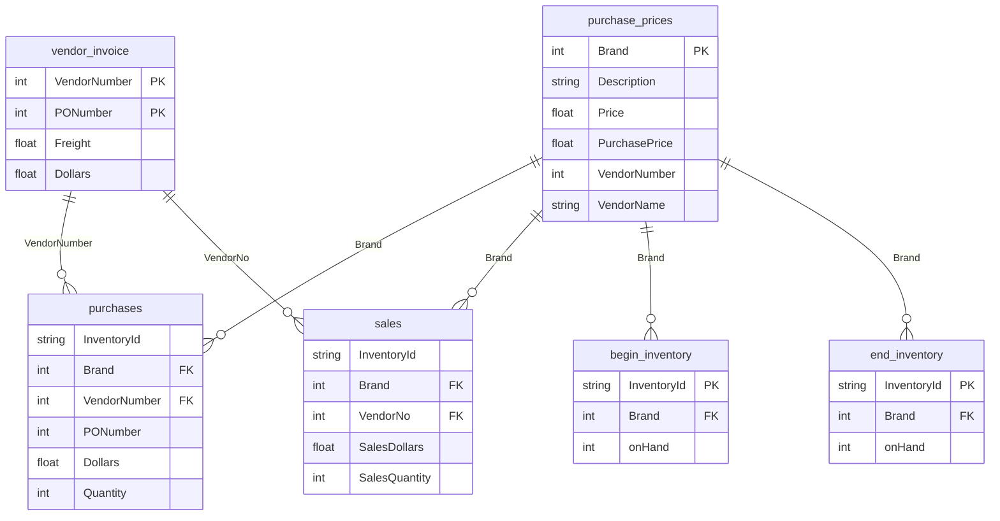

# 📖 Data Dictionary

This document describes the schema, data types, and relationships for all tables in the Vendor Performance Analysis project.

---

## Overview

| Table | Description | Row Count | Columns |
|-------|-------------|-----------|---------|
| `begin_inventory` | Inventory snapshot at start of period | 206,529 | 9 |
| `end_inventory` | Inventory snapshot at end of period | 224,489 | 9 |
| `purchase_prices` | Product pricing and vendor information | 12,261 | 9 |
| `purchases` | Purchase order transactions | 2,372,474 | 16 |
| `sales` | Sales transactions | 12,825,363 | 14 |
| `vendor_invoice` | Vendor invoices with freight costs | 5,543 | 10 |

---

## Table Schemas

### 1. begin_inventory

**Description**: Snapshot of inventory levels at the beginning of the analysis period (2024-01-01).

| Column | Data Type | Nullable | Description | Example |
|--------|-----------|----------|-------------|---------|
| `InventoryId` | VARCHAR | No | Unique identifier: `{Store}_{City}_{Brand}` | `1_HARDERSFIELD_58` |
| `Store` | INTEGER | No | Store identifier number | `1` |
| `City` | VARCHAR | No | City where store is located | `HARDERSFIELD` |
| `Brand` | INTEGER | No | Brand identifier (FK to purchase_prices) | `58` |
| `Description` | VARCHAR | No | Product description | `Gekkeikan Black & Gold Sake` |
| `Size` | VARCHAR | No | Product size/volume | `750mL` |
| `onHand` | INTEGER | No | Quantity on hand at start | `8` |
| `Price` | FLOAT | No | Retail price per unit | `12.99` |
| `startDate` | DATE | No | Snapshot date | `2024-01-01` |

**Primary Key**: `InventoryId`  
**Relationships**: `Brand` → `purchase_prices.Brand`

---

### 2. end_inventory

**Description**: Snapshot of inventory levels at the end of the analysis period (2024-12-31).

| Column | Data Type | Nullable | Description | Example |
|--------|-----------|----------|-------------|---------|
| `InventoryId` | VARCHAR | No | Unique identifier: `{Store}_{City}_{Brand}` | `1_HARDERSFIELD_58` |
| `Store` | INTEGER | No | Store identifier number | `1` |
| `City` | VARCHAR | No | City where store is located | `HARDERSFIELD` |
| `Brand` | INTEGER | No | Brand identifier (FK to purchase_prices) | `58` |
| `Description` | VARCHAR | No | Product description | `Gekkeikan Black & Gold Sake` |
| `Size` | VARCHAR | No | Product size/volume | `750mL` |
| `onHand` | INTEGER | No | Quantity on hand at end | `11` |
| `Price` | FLOAT | No | Retail price per unit | `12.99` |
| `endDate` | DATE | No | Snapshot date | `2024-12-31` |

**Primary Key**: `InventoryId`  
**Relationships**: `Brand` → `purchase_prices.Brand`

---

### 3. purchase_prices

**Description**: Master table for product pricing, classification, and vendor mapping.

| Column | Data Type | Nullable | Description | Example |
|--------|-----------|----------|-------------|---------|
| `Brand` | INTEGER | No | Unique brand/product identifier | `58` |
| `Description` | VARCHAR | No | Product description | `Gekkeikan Black & Gold Sake` |
| `Price` | FLOAT | No | Retail selling price | `12.99` |
| `Size` | VARCHAR | No | Product size label | `750mL` |
| `Volume` | INTEGER | No | Volume in milliliters | `750` |
| `Classification` | INTEGER | No | Product classification code | `1` |
| `PurchasePrice` | FLOAT | No | Wholesale cost price | `9.28` |
| `VendorNumber` | INTEGER | No | Vendor identifier | `8320` |
| `VendorName` | VARCHAR | No | Vendor company name | `SHAW ROSS INT L IMP LTD` |

**Primary Key**: `Brand`  
**Relationships**: `VendorNumber` → `vendor_invoice.VendorNumber`

---

### 4. purchases

**Description**: Detailed purchase order transactions from vendors.

| Column | Data Type | Nullable | Description | Example |
|--------|-----------|----------|-------------|---------|
| `InventoryId` | VARCHAR | No | Inventory location identifier | `69_MOUNTMEND_8412` |
| `Store` | INTEGER | No | Store identifier | `69` |
| `Brand` | INTEGER | No | Brand/product identifier | `8412` |
| `Description` | VARCHAR | No | Product description | `Tequila Ocho Plata Fresno` |
| `Size` | VARCHAR | No | Product size | `750mL` |
| `VendorNumber` | INTEGER | No | Vendor identifier | `105` |
| `VendorName` | VARCHAR | No | Vendor company name | `ALTAMAR BRANDS LLC` |
| `PONumber` | INTEGER | No | Purchase order number | `8124` |
| `PODate` | DATE | No | Purchase order date | `2023-12-21` |
| `ReceivingDate` | DATE | No | Date goods were received | `2024-01-02` |
| `InvoiceDate` | DATE | No | Invoice date | `2024-01-04` |
| `PayDate` | DATE | No | Payment date | `2024-02-16` |
| `PurchasePrice` | FLOAT | No | Cost per unit | `35.71` |
| `Quantity` | INTEGER | No | Quantity purchased | `6` |
| `Dollars` | FLOAT | No | Total purchase amount | `214.26` |
| `Classification` | INTEGER | No | Product classification | `1` |

**Primary Key**: Composite (`InventoryId`, `PONumber`)  
**Relationships**: 
- `Brand` → `purchase_prices.Brand`
- `VendorNumber` → `vendor_invoice.VendorNumber`

---

### 5. sales

**Description**: Detailed sales transactions at the item level.

| Column | Data Type | Nullable | Description | Example |
|--------|-----------|----------|-------------|---------|
| `InventoryId` | VARCHAR | No | Inventory location identifier | `1_HARDERSFIELD_1004` |
| `Store` | INTEGER | No | Store identifier | `1` |
| `Brand` | INTEGER | No | Brand/product identifier | `1004` |
| `Description` | VARCHAR | No | Product description | `Jim Beam w/2 Rocks Glasses` |
| `Size` | VARCHAR | No | Product size | `750mL` |
| `SalesQuantity` | INTEGER | No | Quantity sold | `1` |
| `SalesDollars` | FLOAT | No | Total sale amount | `16.49` |
| `SalesPrice` | FLOAT | No | Unit selling price | `16.49` |
| `SalesDate` | DATE | No | Date of sale | `2024-01-01` |
| `Volume` | FLOAT | No | Volume in milliliters | `750.0` |
| `Classification` | INTEGER | No | Product classification | `1` |
| `ExciseTax` | FLOAT | No | Excise tax amount | `0.79` |
| `VendorNo` | INTEGER | No | Vendor identifier | `12546` |
| `VendorName` | VARCHAR | No | Vendor company name | `JIM BEAM BRANDS COMPANY` |

**Primary Key**: Composite (`InventoryId`, `SalesDate`, transaction sequence)  
**Relationships**: 
- `Brand` → `purchase_prices.Brand`
- `VendorNo` → `vendor_invoice.VendorNumber`

> **Note**: Column name is `VendorNo` (not `VendorNumber`) - differs from other tables.

---

### 6. vendor_invoice

**Description**: Vendor invoice records with freight cost information.

| Column | Data Type | Nullable | Description | Example |
|--------|-----------|----------|-------------|---------|
| `VendorNumber` | INTEGER | No | Vendor identifier | `105` |
| `VendorName` | VARCHAR | No | Vendor company name | `ALTAMAR BRANDS LLC` |
| `InvoiceDate` | DATE | No | Invoice date | `2024-01-04` |
| `PONumber` | INTEGER | No | Purchase order number | `8124` |
| `PODate` | DATE | No | Purchase order date | `2023-12-21` |
| `PayDate` | DATE | No | Payment date | `2024-02-16` |
| `Quantity` | INTEGER | No | Quantity on invoice | `6` |
| `Dollars` | FLOAT | No | Invoice amount | `214.26` |
| `Freight` | FLOAT | No | Freight/shipping cost | `3.47` |
| `Approval` | VARCHAR | **Yes** | Approver name (98% null) | `Frank Delahunt` |

**Primary Key**: Composite (`VendorNumber`, `PONumber`, `InvoiceDate`)  
**Relationships**: None (reference table)

> **Note**: `Approval` column has ~98% null values.

---

## Entity Relationship Diagram

---

## Derived Table: vendor_sales_summary

**Description**: Aggregated summary table created by `get_vendor_summary.py` for analysis.

| Column | Data Type | Description | Formula |
|--------|-----------|-------------|---------|
| `VendorNumber` | INTEGER | Vendor identifier | From `purchases` |
| `VendorName` | VARCHAR | Vendor company name | From `purchases` |
| `Brand` | INTEGER | Brand identifier | From `purchases` |
| `Description` | VARCHAR | Product description | From `purchases` |
| `PurchasePrice` | FLOAT | Unit purchase cost | From `purchases` |
| `Volume` | FLOAT | Volume in mL | From `purchase_prices` |
| `ActualPrice` | FLOAT | Retail price | From `purchase_prices` |
| `TotalPurchaseQuantity` | INTEGER | Sum of purchased units | `SUM(p.Quantity)` |
| `TotalPurchaseDollars` | FLOAT | Sum of purchase spend | `SUM(p.Dollars)` |
| `TotalSalesQuantity` | FLOAT | Sum of units sold | `SUM(s.SalesQuantity)` |
| `TotalSalesDollars` | FLOAT | Sum of sales revenue | `SUM(s.SalesDollars)` |
| `TotalSalesPrice` | FLOAT | Sum of unit prices | `SUM(s.SalesPrice)` |
| `TotalExciseTax` | FLOAT | Sum of excise taxes | `SUM(s.ExciseTax)` |
| `FreightCost` | FLOAT | Total freight for vendor | `SUM(f.Freight)` |
| `GrossProfit` | FLOAT | Revenue minus cost | `TotalSalesDollars - TotalPurchaseDollars` |
| `ProfitMargin` | FLOAT | Profit as % of revenue | `(GrossProfit / TotalSalesDollars) * 100` |
| `StockTurnover` | FLOAT | Sales efficiency ratio | `TotalSalesQuantity / TotalPurchaseQuantity` |
| `Sales_To_Purchase_Ratio` | FLOAT | Revenue to cost ratio | `TotalSalesDollars / TotalPurchaseDollars` |

---

## Data Quality Notes

1. **No nulls in source tables** (except `Approval` in `vendor_invoice`)
2. **Date range**: 2024-01-01 to 2024-12-31 (full year)
3. **Volume inconsistency**: Some tables have `Volume` as INTEGER, others as FLOAT
4. **Vendor ID naming**: `sales` uses `VendorNo`, other tables use `VendorNumber`
5. **Approval column**: 98% null - consider dropping or investigating business process

---

## Change Log

| Date | Author | Description |
|------|--------|-------------|
| 2025-12-24 | Auto-generated | Initial data dictionary creation |
